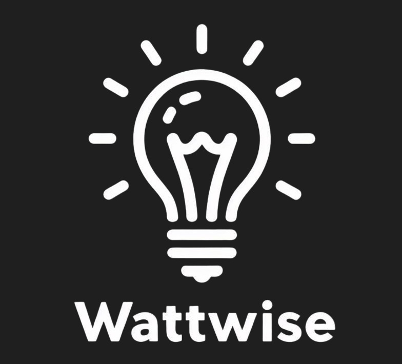

# WattWise

**HackUDC 2024**

Proyecto desarrollado en el hackatón *HackUDC 2024* como solución al reto propuesto por la empresa patrocinadora *Gradiant*. 

A través de un `servicio web`, implementamos una serie de funcionalidades que permiten obtener información valiosa sobre el `consumo energético` 💡 de una vivienda.
Estas funcionalidades están divididas en dos enfoques principales: conocer cómo consumes tu energía eléctrica y descubrir maneras de ahorrar en tu consumo. 
Las enfocadas a `conocer tu propia factura` 🧾 son:
  - Información gráfica sobre el consumo medio por días de la semana, y más específicamente en tramos horarios (mañana, tarde y noche): permite ver un desglose de tus gastos y reconocer patrones (días festivos, batch cooking...)
  - Diferencia en el consumo en los últimos 30 días con respecto a los 30 días anteriores: diferenciar si existe una tendencia en el consumo, ya sea al alza o a la baja.
  - Información sobre el precio de la luz medio por días de la semana y tramos horarios: permite comparar tus patrones de gasto con los precios de la luz.
  - Consumo semanal por horas del día y días de la semana: permiten identificar patrones de consumo, como horas especialmente activas o días no laborables.
  - Precio pagado por días de la semana y tramos horarios: junta la información sobre el uso del consumidor y los precios en esos momentos, para mostras días de mucho gasto, días muy rentables...

Además, un modelo de lenguaje describe de forma detallada cada gráfica, de manera que el usuario tendrá una explicación personalizada generada automáticamente según su consumo eléctrico.

Las funcionalidades enfocadas a `ahorrar en el consumo energético` 💰 son las siguientes:
  - Predicción del consumo energético futuro del cliente a través de una red de neuronas GRU
  - Predicción del precio de la luz futuro, también a través de una red de neuronas GRU.
Al juntar estas predicciones, podemos informar al cliente de cuando se le acerca un día de consumo y precio elevados, de días a aprovechar para aumentar su consumo y reducirlo en días más caros...

